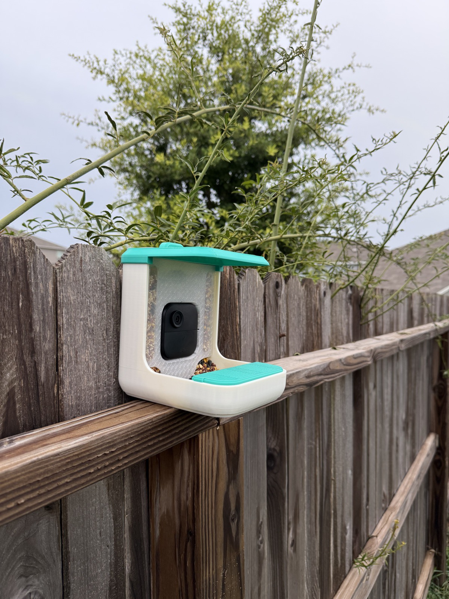

There's a great song from the 90s that's become very applicable to my Raspberry Pi bird-feeder camera project: *Hey Man Nice Shot* by Filter. You probably already understand what I'm getting at.

What seemed like a straightforward idea that showed some very quick initial progress (all the way up to 80%, right?) hit some difficult roadblocks. Somewhere around week two of contemplating how to overcome these challenges, I started thinking about an easier route — and I'm now enjoying watching birds at my feeder from my phone, anywhere with an internet connection. Success, right? Sure, sort of. Scrapping an original idea always comes with a little bit of tail between your legs, though. Probably more so, because I proclaimed just a few posts ago that this problem was mostly *solved*.

There's something to be said for moving on before a sunk-cost fallacy grows out of control. And we were definitely headed in that direction as I contemplated how to manage the thermal load of the Pi Zero 2 W in a sealed container on a South Texas summer day. There's a much simpler solution to the problem I was solving. Just use a Blink Outdoor 4 camera, do a little hacking to change the camera's focus, 3D-print a feeder with an opening for the camera out of ASA, and you're watching birds on your phone.

Yes, going with Blink gives up the no-cloud-server idea I had, adds a small monthly cost, and required minimal hacking of anything. And maybe that was the letdown for me. Still, we've got a working bird feeder for a very competitive monthly cost and a lower unit cost than the commercial product. I have a simple tenet when it comes to building personal projects, though: it's only a failure if you don't learn something. And there's plenty to learn here about why Blink over Pi.

Starting out, the Pi Zero 2 W seemed great because it packed a lot of utility and options into a small board with low power requirements. This is true compared to devices like other Raspberry Pi boards, but not true compared to a dedicated, engineered outdoor camera. At first, this just seemed like a power-reserves problem. Quick calculations made it clear that I needed a sizable battery to keep the Pi happy, especially overnight when there was no sun, but also no birds. So I planned to have the Pi turn the motion sensor and camera completely off at twilight to sip power. All that needed to be done then was to scale a LiFePO4 battery appropriately, use a buck converter to deliver 5 V to the Pi, and add a 12 V solar panel to keep the battery topped off during the day. While it looked like a junk-drawer bin taped together, it was fairly functional.

Factoring a 120 mA draw at 5 V, and a 300 mA draw while capturing or streaming, it's safe to average power consumption to 1 watt. That's 24 Wh per day. A 4S pack around 5 Ah at 12.8 V holds about 60–75 Wh, and a 10 W solar panel has no problem topping the battery back up over the day.

With that in mind, it was time to test it outdoors, and initially, everything seemed to work. The local birds weren't acclimated to the feeder, so I didn't get any visitors, but I could log in remotely and check how the camera was doing. By noon, there was a problem. The camera feed started to glitch. A quick check of the status page revealed a Pi that was being fully throttled at a steady 80 °C. Ouch. I had the Pi in a simple prototype enclosure with venting. I tried the Pi bare, with no enclosure, and temps were still in the 70s. This made it clear that if I went with this system, I'd need a novel way to cool it and maintain proper operating temps. I brainstormed some plans for a fancy cooling passageway with a fan (more power required, of course) and even considered a radiator/heat stack running out of the enclosure. I think these ideas could have worked, but that's where I paused. Any of these solutions was going to eat a lot of time, effort, and money. It was clear that I was trying to force a Raspberry Pi into this project, not because it was actually the best way to do it.

So, what about the Pi Zero 2 W made it a dead end? The battery size needed was the first clue. Those relatively low power requirements for a Pi Zero 2 W are orders of magnitude higher than a Blink camera — roughly 1,200x more. What didn't sink in for me right away is that basically all that power becomes heat in this device. It's how electronics work. All that heat has to be managed, creating all kinds of new challenges for other requirements, like weather sealing. Running Linux, serving Wi-Fi, hosting a range of GPIO/USB devices, and outputting to a display (when activated) all mean more compute must be on hand to do those things. For a bird feeder camera, these things are unnecessary. Realization unlocked.

Even with a headless version of Linux installed, the Pi is doing way more tasks at idle than a Blink camera. The Pi's flexibility locks it into the classic 'jack of all trades' trap, but here applied to electronics. The ARM64 SoC just uses more power to have the ability to do all of these things. That power means more heat to lose, which is a real challenge given the enclosure needed to reasonably seal a Pi against South Texas weather. This time of year, a summer day is typically 35–38 °C. The Pi stayed at 80 °C, so we're looking at a delta-T of 45 °C. A 1 W bulb produces one joule of heat per second. In a very small volume (~96 cm³, roughly the Pi's 3D-printed enclosure), that accumulation of joules will heat-soak the enclosure in a matter of minutes, as I found out. 45 degrees of headroom and 96 cm³ of air as thermal mass were never going to keep the Pi out of trouble.

So, is there a good way to do this better from the beginning? Definitely. I used the Pi because it's what I had on hand. But that initial decision created the problem I didn't anticipate all along: heat. In the end, the power-source problem is just another symptom of the heat problem. The main challenge *seemed* to be having enough power to run the Pi constantly — but I didn't recognize the real effect of consuming all that power. The power math was pretty simple, and the heat math would have been simple too. I set a specification (use a Pi Zero 2 W) that didn't match the requirement (minimal heat buildup, given the environment and the sealing). Understand the requirements, then make spec decisions. That's a pretty good lesson to carry forward.
