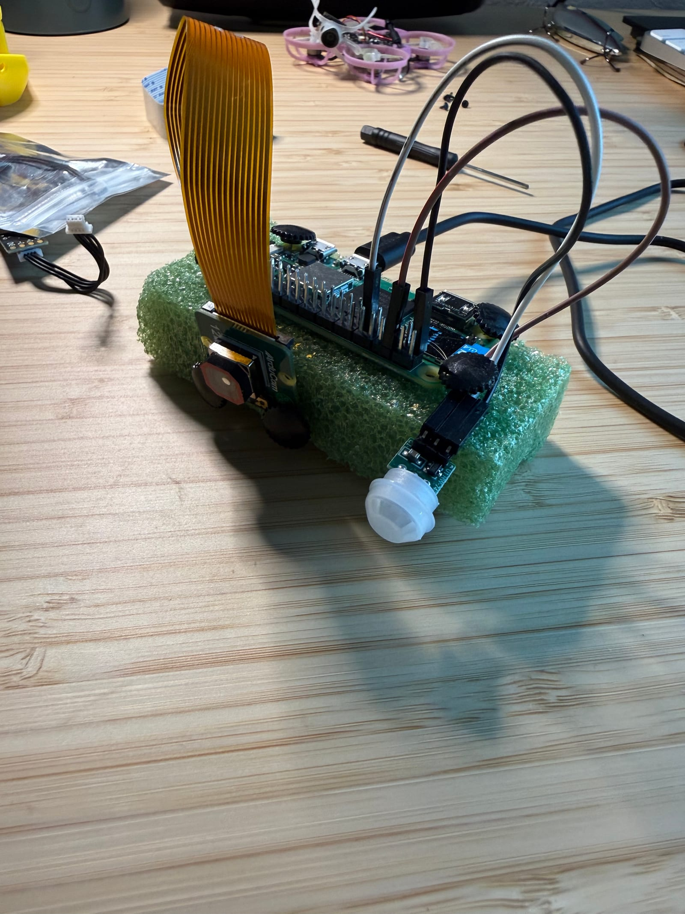
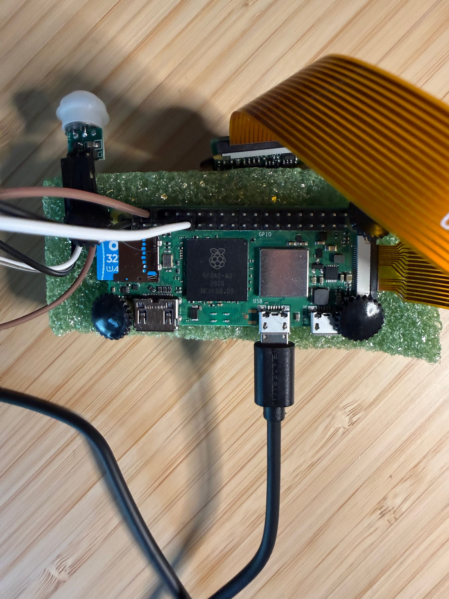

Millennials are apparently the youngest generation of bird watchers ever. Probably because we can't afford expensive mid-life crises, so a pair of binoculars, a hat, and a book or two will have to do. I only jest — any hobby can become exorbitantly expensive. That's where I found myself: in the ~~local redneck emporium~~ Bass Pro Shops, contemplating a fancy bird feeder camera.

It looked well thought out, had good reviews, and would definitely be much easier to set up than the road I'm currently on. But something about subscription models — and the way every business is racing to deploy them — just grinds my gears. I don't need to pay a monthly fee to share my backyard WiFi camera feed with a CCP shell corp. There's a small voice in my head that whispers more and more these days: *can you just make this?*

The answer is yes, but there are always a few catches. First, there's no free lunch. Despite all the amazing advances of our coding agents, there's no snapping your fingers to make this idea — and most other bridges between software and hardware — suddenly exist. An Amazon camera will be far easier to set up and use, so if you really value your time and just want to see birds, go buy one.

But if you're like me and like to learn stuff along the way, this is a great project. The next challenge is what I'd call *death by a thousand cuts*. There's a multitude of decisions, and each one carries a potential drawback. An early choice, made wrong, can quietly hamstring you much later. Which is a pretty accurate description of engineering itself. So here's where I am: real progress made, but second-guessing a few of those early decisions.

First and foremost, it needed a good name, and this one came straightaway: birdseed. Except it also doubles as bird-see'd — as in, what birds did you see? Okay, puns aside. One of the consequential early decisions was the main board: a Raspberry Pi Zero 2 W. From my initial research, it seemed to do everything I need. A well-developed Linux ecosystem, a host of accessories that play nice, and — maybe to my detriment — it's familiar ground for me. I've set up the environment on my other Pis a few times: flash a card with the OS, SSH in, set up keys, the usual.

For accessories, the AM312 is a perfect little PIR motion sensor — more than capable of noticing a bird land at the feeder and triggering a capture. Picamera2 is great too, with a manual-focus mode that'll hold a subject as close as 10cm from the lens. And it looks very doable to keep the Pi alive on a solar-and-battery combo.

The guiding idea is twofold: build it cloudless — no external server, the Pi hosts a local website on the home WiFi — and keep the Pi simple to hold power consumption down. In truth, those two principles are a little at odds. Hosting a local site means firing up the Pi's WiFi radio every time someone pings it, and that radio is a potentially significant draw on a solar-and-battery setup — something to keep an eye on. A truly dumb Pi Zero would probably just push data periodically to a second Pi sitting indoors on wall power. Let that one do the serving, and there are fewer power worries when you're showing off a blue warbler.

Still, this is all part of the learning process. Getting the Pi to a state where a motion trigger produces a video clip was relatively straightforward. A simple script keeps the AM312 armed and calls the camera when it trips. The camera records a 1080p H.264 clip that ffmpeg wraps into an MP4 right there on the Pi. The last bit is easy too: serve those clips to the local network in chronological order, viewable from any phone or computer at `http://birdseed.local`. The whole thing happens within seconds. Here's a clip of my dog investigating the strange new blinking light in the living room:

<video controls playsinline muted preload="metadata" src="/birdseed-dog.mp4" style="width:100%;border:1px solid var(--rule);border-radius:4px;margin:1.5rem 0;"></video>

The initial work is mostly done. Next steps: sort out the solar-and-battery rig and an enclosure that'll actually live on a bird feeder. And honestly, that power problem is a lot harder than I first gave it credit for. Working through it has me second-guessing that first big decision — the Raspberry Pi itself. Is an ESP32 just the better tool for this?
