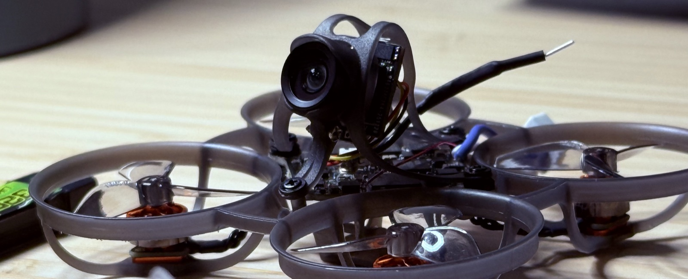

Remember a piece of technology that gave you an absolute sense of marvel? That *how is this possible* feeling? One particularly formative one for me was in the spring of 2017. My first Tiny Whoop flight. Just what is a Tiny Whoop? Tiny Whoops are small quadcopters that probably belong more in the category of kid's toy than anything else. But this diminutive little drone is truly a marvel of hardware and software.

Why? It's the smallest quadcopter that offers a first person view (FPV) experience. It's a sub-20 gram aircraft that transmits a feed from the aircraft's perspective as you zip around your house, your garage, a park, the mall, etc. Which leads to another great aspect: thanks to the Tiny Whoop's micro proportions, it's far more friendly to fly in these spaces and minimally dangerous to people/animals/stuff. Whoops are also pretty cheap in an otherwise expensive hobby. You can start flying for less than $200. They're pretty tough too, capable of some bonks on furniture or walls (thanks to the ducted props) without damage to the object or the drone, within reason. 

That first flying experience was transformative. Even though the video was a sometimes glitchy analog signal, the sense of freedom and wonder was *everything*. I saw the world through a brand new perspective, more like a sparrow than anything else. Along the way, Tiny Whoops gave me a fantastic introductory education to micro-electronics, digital and analog signals, firmware, CLI, the list goes on. 

Since my introduction to Whoops, it's been amazing to see the advancement. They've gotten lighter (my first one, the Blade Inductrix, weighed about 26 grams). They now have integrated video transmitters, radios, ESCs, the board is all in one. They've gone brushless (my OG Inductrix had brushed motors). The latest jump is Whoops carrying digital HD cameras. It's an incredible evolution in a small corner of hobby electronics. Along the way, there's been a consolidation in the industry. 

Back in 2017, all kinds of companies were producing boards and components for Tiny Whoops. Now, the industry (from my perspective) has consolidated around two main manufacturers: BetaFPV and HappyModel. Of those, BetaFPV is the biggest. There are a few other players in the industry, but if you're looking to buy a Tiny Whoop now, that search probably starts at BetaFPV's Air65/Air75. It'll be no surprise to you that BetaFPV and HappyModel are headquartered in Shenzhen, China. 

BetaFPV makes a whole line of hobby quadcopters for international markets. While this is just a tiny corner in the consumer chips market, the evolution of Tiny Whoops is exceptionally illustrative. The humble Tiny Whoop is a seminar in embedded systems design and manufacturing and demonstrates China's ability to do just that. Scale these capabilities across so many applications and devices and now you can start to see where America is lagging behind. I think it's a great project to learn from as we work to reshore these capabilities in the US once more. 

That reshoring is something I absolutely want to contribute to. The world is pretty well focused on GPUs, and for good reason. But we need a whole bunch of compute at Tiny Whoop levels too. Admittedly, I'm no expert. I'm someone who's willing to learn and share in public for the good of everyone. If I've learned anything over the last few years it's that our own advancements in other technologies (ahem AI) now open the door to learning and building just about anything. Importantly, I'm also not saying we need to build an American Shenzhen. Copying is no way to advancement, as the Soviets found out in Zelenograd. We must innovate our own path to restore our capability and independence. First, we have to pull ourselves back to the frontier of what's possible in silicon. Get back that wonder of what we can make here. And still fly some Tiny Whoops. 
