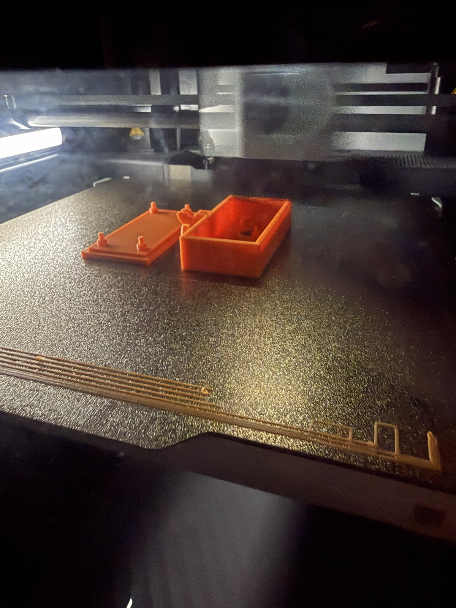

It's easy to approvingly nod along with someone quoting Elon Musk's famous phrase "Hardware is hard." Anyone with even mild Lego building experience intrinsically understands that there's a significant gap between the vision and final result of a creative build. Our brains willingly accept that conjuring our magic widget into existence will be difficult. The problem is, the phrase actually doesn't do the difficulty justice.

Now you'd be right to say that's Elon's whole point, just in his tongue-in-cheek style. But it lands differently when you look at an amalgamation of wires, cables, components and a battery in a mess on your porch that technically is a WiFi birdfeeder camera. That's where I found myself earlier this week. Birdseed is capable of doing all the things I dreamed up (so far), which is great. I have components that can record clips triggered by motion without a power outlet. I should be about 80% done, just need to work out an enclosure and a few details right?

The problem, of course, is that the last 20% can be the toughest. There's all kinds of good ideas written by many other people describing this. I would offer this explanation to that discussion: the last 20% is the culmination of all the previous decisions. All the small details that you may or may not have paid attention to create real consequences in the final implementation.

So, where does that leave me in this project? And what have I learned? First, be specific in initial specs and requirements. Early on, I thought I had a great idea to forego a LiFePO4 for a lithium ion power bank instead. The power bank checked all the right boxes for physical size, capacity, environmental sealing, etc. I missed a critical detail though - pretty much all lithium ion power banks don't support pass-through charging; they won't charge and discharge at the same time. Being able to charge via solar while sipping power for the raspberry pi is my entire use case. Whoops.

Had I been more thorough in detailing my assumptions that underlie my specs and requirements, I think I could have caught this. Oh well, I've got a nice power bank for camping. That's part of a larger lesson too. Small mistakes in a project like this are okay. It's part of learning. But this oversight would have been absolutely fatal at scale. Everyone wants to see their project start to come to life, but it's critical to be diligent in the initial planning and research, and I will do this next time. For now, we're back to using a 12V LiFePO4 with PWM solar controller and a buck converter for the pi.

Component fit/aesthetics are a whole different animal. Figuring out how to fit a relatively delicate camera ribbon, some jumper wires and all the boards in a case is no small task. All the while the case and components need to take on the full extent of South Texas weather. In open air, the board is already running ~60 deg C. The pi zero 2W throttles at 80 deg C, so there's headroom, but it's not much. For now, we may need some creative heat management while retaining sealing for the final product and I've got some prototype enclosures printing right now.

After all that, I think there's another straightforward explanation to why the last 20% seems so difficult. It was never 20% at all. It's more likely that understanding the scale of a project and where you're at on that scale is its own challenge. Knowing where you really are on that scale might be the whole game. And this makes me truly in awe of some of the crazy undertakings human beings have accomplished.
